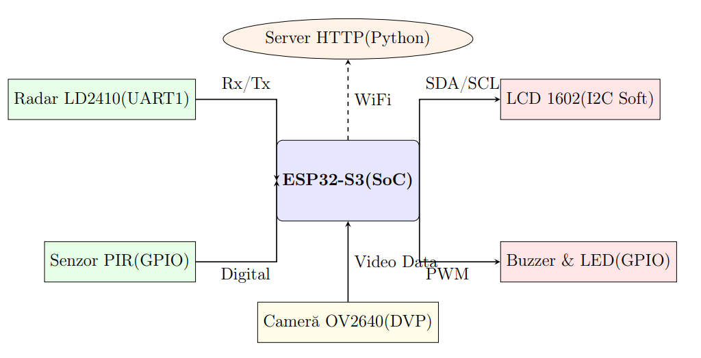
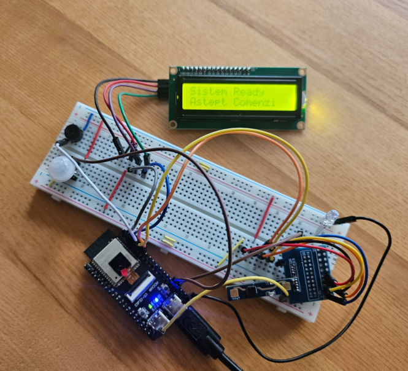
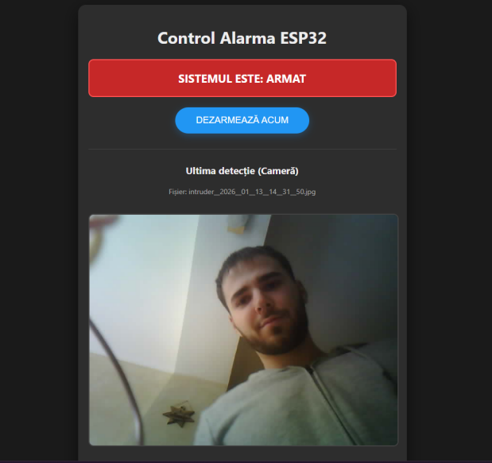

# Dual-Detection Security System (Radar + PIR) with ESP32-S3

## Overview
This repository contains the source code and documentation for a hybrid security system built around the ESP32-S3 microcontroller. The system integrates Frequency Modulated Continuous Wave (FMCW) mmWave Radar technology with Passive Infrared (PIR) detection to completely eliminate the false alarms commonly associated with conventional security systems. 

Upon detecting a validated intrusion, the system triggers local audio-visual alerts, captures an image of the intruder, and transmits it via HTTP to a custom Python backend server for storage and remote monitoring.

## Key Technical Features
* **Sensor Fusion Logic:** An algorithm cross-validates data from both the LD2410 Radar and the AM312 PIR sensor, triggering alarms only upon simultaneous detection, thus filtering out thermal interference and non-human movement.
* **Bare-Metal Programming:** To ensure strict timing and minimal latency, critical peripheral drivers were developed using direct memory-mapped I/O (Register-Level Programming) instead of standard Arduino HAL libraries.
    * **UART (FIFO):** Direct hardware queue access for high-speed (256,000 baud) communication with the radar module, bypassing standard software buffers.
    * **Software I2C (Bit-Banging):** Custom I2C protocol implementation via direct GPIO manipulation (Set/Clear registers) to control the 1602 LCD module.
* **Non-Blocking Architecture:** The main execution loop utilizes a polling-based scheduler rather than hardware interrupts, preventing watchdog resets during network transmission and camera operations.
* **Full-Stack IoT Integration:** Includes a Python/Flask HTTP backend server that stores captured JPEG evidence and serves a web dashboard for remote arming/disarming.

## Hardware Architecture

* **Microcontroller:** ESP32-S3-WROOM-1 (Dual-Core Xtensa LX7)
* **Sensors:** * Hi-Link LD2410B mmWave Radar (24 GHz FMCW)
    * AM312 Digital PIR Sensor 
* **Camera:** OV2640 (DVP Interface, Hardware JPEG compression)
* **Display & Actuators:** LCD 1602 with PCF8574 I2C expander, Active Buzzer, LED.

## Software Stack
* **Firmware:** C++ (Standard C++11/17), developed using VS Code with PlatformIO.
* **Backend Server:** Python 3.10 with the Flask micro-framework.
* **Web Interface:** HTML5/CSS3 and Jinja2 templating.

## Project Setup

### 1. Backend Server Setup
1. Navigate to the `server/` directory.
2. Install dependencies: `pip install flask`
3. Run the server: `python server.py`
4. Ensure the host machine is on the same local network as the ESP32. Note the IP address displayed in the console.

### 2. ESP32 Firmware Setup
1. Open the project in VS Code with the PlatformIO extension.
2. Modify the Wi-Fi credentials and the `SERVER_URL` in `main.cpp` to match your network and Python server IP.
3. Build and upload the code to the ESP32-S3 board.

## How It Works
1. **Boot & Connect:** The ESP32 initializes its direct-register peripherals and connects to the Wi-Fi network.
2. **Polling & Monitoring:** The firmware continuously reads the hardware UART FIFO for radar telemetry and polls the PIR sensor via GPIO.
3. **Validation:** If the system is armed via the Web Dashboard, it requires both the PIR to signal motion and the Radar to confirm target presence (moving or static breathing).
4. **Alert & Capture:** Upon validation, local alerts activate. The OV2640 captures a JPEG frame and transmits it via an HTTP POST request to the Python backend.

